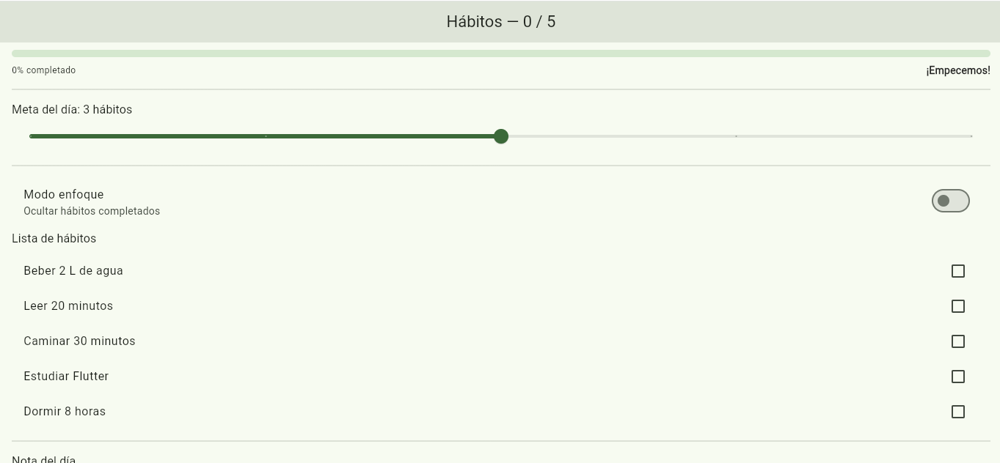
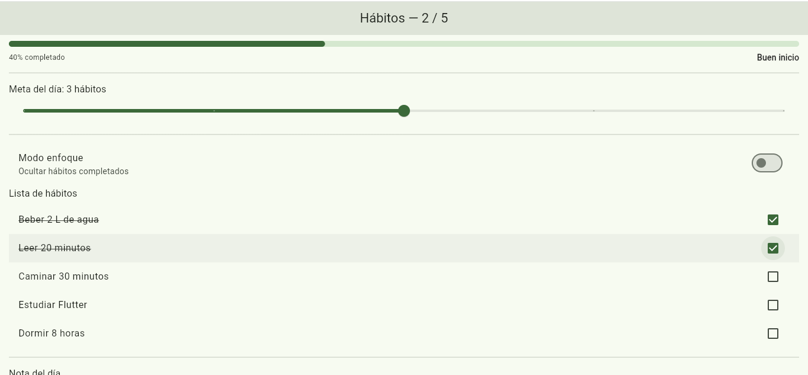
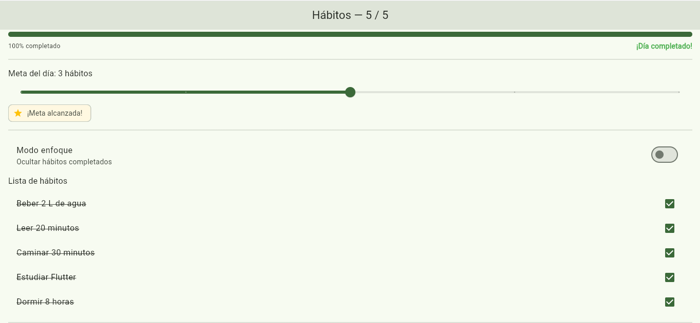
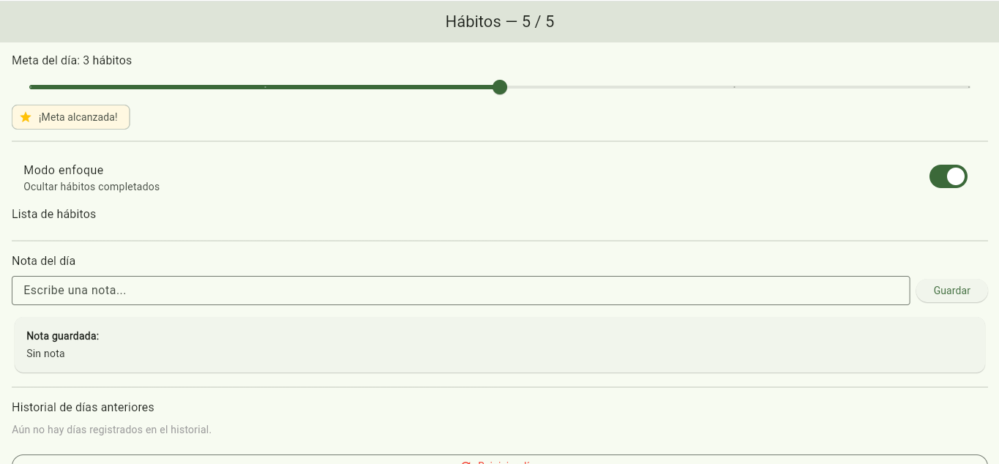

# Panel de Hábitos del Día

Aplicación interactiva desarrollada en Flutter para la gestión y seguimiento diario de hábitos de manera dinámica y en tiempo real. Este proyecto fue construido utilizando únicamente `StatefulWidget` y `setState()` para el manejo de estado simple y sincronizado de la interfaz de usuario.

---

## Variables de Estado Utilizadas

El estado de la aplicación vive dentro de la clase `_PanelHabitosState` y se compone de las siguientes variables independientes:

- **`_cumplidos` (`List<bool>`):** Mantiene el registro individual de qué hábitos han sido marcados como completados (`true`) o pendientes (`false`).
- **`_meta` (`int`):** Almacena el número de hábitos que la persona se propone cumplir durante el día (ajustable mediante un `Slider`).
- **`_enfoque` (`bool`):** Determina si el "Modo enfoque" está activo (`true`) para ocultar visualmente de la lista los hábitos que ya fueron cumplidos.
- **`_nota` (`String`):** Almacena la nota o comentario final ingresado por la persona para guardarlo y mostrarlo en la tarjeta de resumen.
- **`_notaCtrl` (`TextEditingController`):** Controlador de texto vinculado al campo `TextField` para capturar la entrada del usuario de forma eficiente.
- **`_historial` (`List<int>`):** *(Extensión opcional)* Almacena la cantidad de hábitos cumplidos en los días anteriores cada vez que se reinicia la jornada.

> **Información derivada (Getters):** Valores como `_totalCumplidos`, `_progreso`, `_metaAlcanzada` y `_mensaje` se calculan dinámicamente mediante *getters* en lugar de guardarse como estado duplicado, garantizando una única fuente de verdad.

---

## Capturas de Pantalla

| Estado Inicial (0%) | Progreso Parcial | Día Completado (100%) | Modo Enfoque Activo |
| :---: | :---: | :---: | :---: |
|  |  |  |  |

---

## Reflexión sobre el Manejo de Estado

Durante el desarrollo de esta interfaz dinámica, uno de los riesgos principales era la **desincronización del estado por duplicación de información**, por ejemplo, guardar un contador independiente para los hábitos cumplidos. Si se maneja `_totalCumplidos` como una variable de estado separada, existía el peligro de actualizar la lista `_cumplidos` pero olvidar incrementar o decrementar el contador, haciendo que la AppBar y la barra de progreso mostraran datos inconsistentes. 

Para evitar este problema, apliqué buenas prácticas al calcular la información dependiente a través de **getters derivados** (`_totalCumplidos`, `_progreso`, `_metaAlcanzada`), garantizando que la interfaz siempre refleje el estado real de forma coordinada. Asimismo, se cuidó envolver todas las mutaciones directas exclusivamente dentro de llamadas a `setState()` y se gestionó el ciclo de vida del controlador de texto liberándolo en el método `dispose()` para prevenir fugas de memoria.

---

## Cómo ejecutar el proyecto

1. Clonar el repositorio:
   ```bash
   git clone [https://github.com/JuanJ22/lab_habitos_juan_perez.git](https://github.com/JuanJ22/lab_habitos_juan_perez.git)
